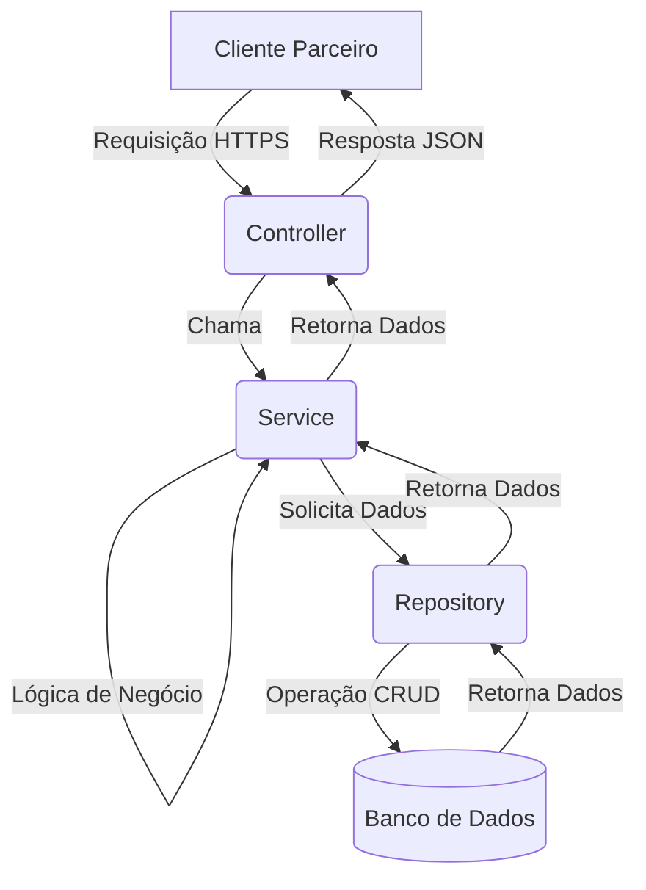

# API de Parceiros - Produtos


## 📖 Sobre o Projeto

Esta é uma API RESTful desenvolvida como solução para o Desafio Final da Pós-Graduação em Arquitetura de Software. O projeto consiste em uma API robusta e segura para expor dados de **Produtos** a parceiros comerciais, implementando uma arquitetura em camadas, boas práticas de desenvolvimento e segurança via JWT.

---

## ✨ Funcionalidades Principais

-   ✅ **Arquitetura em Camadas:** Implementação do padrão MVC com separação explícita de responsabilidades (Controllers, Services, Repositories).
-   ✅ **Operações CRUD Completas:** Endpoints para Criar, Ler, Atualizar e Deletar produtos.
-   ✅ **Funcionalidades Adicionais:** Endpoints para contagem total de produtos e busca por nome.
-   ✅ **Segurança com JWT:** Acesso aos endpoints protegido por autenticação via Bearer Token (JSON Web Tokens).
-   ✅ **Configuração por Ambiente:** Gestão de configurações para ambientes de desenvolvimento, teste e produção.
-   ✅ **Testes Automatizados:** Suíte de testes unitários e de integração para garantir a qualidade e estabilidade da API.

---

## 🛠️ Arquitetura e Tecnologias

O projeto foi construído utilizando as seguintes tecnologias e padrões:

-   **Python 3.10+**
-   **Flask:** Micro-framework web para a construção da API.
-   **PyJWT:** Para geração e validação dos tokens de autenticação.
-   **Pytest:** Para a suíte de testes automatizados.
-   **Dotenv:** Para gestão de variáveis de ambiente.
-   **Padrão Arquitetural:** MVC, com camadas de Serviço e Repositório.

### Diagrama Simplificado da Arquitetura



---

## 🚀 Como Executar o Projeto

Siga os passos abaixo para configurar e executar o projeto localmente.

### Pré-requisitos

-   [Python 3.10](https://www.python.org/downloads/) ou superior
-   [Git](https://git-scm.com/downloads/)

### 1. Clonar o Repositório

```bash
git clone [https://github.com/seu-usuario/api-parceiros-flask.git](https://github.com/seu-usuario/api-parceiros-flask.git)
cd api-parceiros-flask
```

### 2. Criar e Ativar o Ambiente Virtual

É uma boa prática usar um ambiente virtual para isolar as dependências do projeto.

```bash
# Criar o ambiente virtual
python -m venv venv

# Ativar no Windows
.\venv\Scripts\activate

# Ativar no macOS/Linux
source venv/bin/activate
```

### 3. Instalar as Dependências

```bash
pip install -r requirements.txt
```

### 4. Configurar as Variáveis de Ambiente

Crie um ficheiro chamado `.env` na raiz do projeto, copiando o conteúdo do `.env.example`.

```bash
# No Windows (usando copy)
copy .env.example .env

# No macOS/Linux (usando cp)
cp .env.example .env
```

Abra o ficheiro `.env` e **gere uma nova chave secreta**. Pode usar o comando abaixo para gerar uma:

```bash
python -c "import secrets; print(secrets.token_hex(24))"
```

O seu `.env` deverá ficar assim (com a sua chave):

```
FLASK_APP=run.py
FLASK_ENV=development
SECRET_KEY='sua_chave_secreta_gerada_aqui'
```

### 5. Executar a Aplicação

Com tudo configurado, inicie o servidor Flask:

```bash
flask run
```

A API estará disponível em `http://127.0.0.1:5000`.

---

## 🧪 Como Executar os Testes

Para garantir que tudo está a funcionar como esperado, execute a suíte de testes completa com o `pytest`:

```bash
pytest
```

---

## 📋 Endpoints da API


### Autenticação

| Método | Endpoint      | Descrição                                        |
| :----- | :------------ | :----------------------------------------------- |
| `POST` | `/auth/login` | Autentica um parceiro e retorna um token de acesso JWT. |

### Produtos (Requer Token de Autenticação)

| Método | Endpoint                 | Descrição                         |
| :----- | :----------------------- | :-------------------------------- |
| `GET`  | `/produtos`              | Lista todos os produtos.          |
| `POST` | `/produtos`              | Cria um novo produto.             |
| `GET`  | `/produtos/{id}`         | Obtém um produto específico.      |
| `PUT`  | `/produtos/{id}`         | Atualiza um produto.              |
| `DELETE`| `/produtos/{id}`         | Deleta um produto.                |
| `GET`  | `/produtos/count`        | Retorna a contagem de produtos.   |
| `GET`  | `/produtos/search?name=` | Busca produtos por nome.          |

